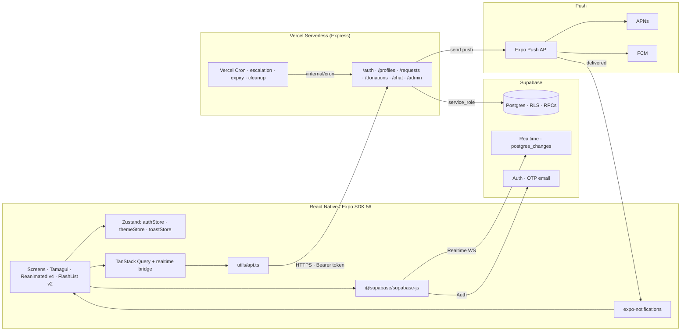
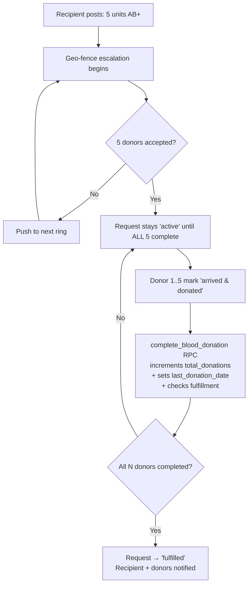
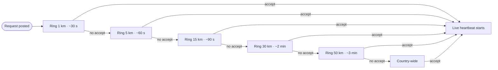

<div align="center">

# BludStack

**The fastest way to find a blood donor.**

A production-grade, real-time blood donation network. Recipients post requests in seconds. Compatible donors nearby are notified instantly. Lives are saved on the same map, in the same minute.

<br />


<br />


<br />

[**Live API**](https://bludstack.vercel.app) · [**Issues**](https://github.com/aashir-athar/BludStack/issues) · [**Discussions**](https://github.com/aashir-athar/BludStack/discussions) · [**Roadmap**](#roadmap)

</div>

---

## Why BludStack exists

Every two seconds, someone somewhere needs blood. In emergencies, the bottleneck isn't supply - it's the **time it takes to find a compatible donor nearby**. Hospitals call relatives. Relatives forward WhatsApp messages. Messages spread to people who can't help. By the time a compatible donor sees the request, the window is closed.

BludStack flips that. The moment a recipient pins their hospital, our backend expands outward in geo-fenced rings - **1 km → 5 km → 15 km → 30 km → 50 km → country-wide** - pushing real-time alerts only to **compatible, eligible, available donors** at each stage. When a donor accepts, the recipient sees their live GPS heartbeat on a map. Like Uber, but for the most important ride of someone's life.

---

## Table of contents

1. [Highlights](#highlights)
2. [Architecture](#architecture)
3. [Tech stack](#tech-stack)
4. [Project structure](#project-structure)
5. [The N-donors rule](#the-n-donors-rule)
6. [Geo-fence escalation algorithm](#geo-fence-escalation-algorithm)
7. [Blood compatibility matrix](#blood-compatibility-matrix)
8. [Design system](#design-system)
9. [Performance budget](#performance-budget)
10. [Security model](#security-model)
11. [Backend setup](#backend-setup)
12. [Mobile setup](#mobile-setup)
13. [Environment variables](#environment-variables)
14. [Deployment](#deployment)
15. [Cron jobs](#cron-jobs)
16. [Push notifications](#push-notifications)
17. [API reference](#api-reference)
18. [Database schema](#database-schema)
19. [Roadmap](#roadmap)
20. [FAQ](#faq)
21. [Contributing](#contributing)
22. [License](#license)
23. [Author](#author)

---

## Highlights

- **Real-time push escalation** - compatible donors in widening geo-rings are paged in priority order until someone accepts. No SMS fan-out, no group chats, no time wasted on incompatibles.
- **Atomic accept + complete RPCs** - `accept_blood_request` and `complete_blood_donation` are `SECURITY DEFINER` PostgreSQL functions that enforce capacity, cooldown, age, and the N-donors rule in a single transaction. No race conditions, no double-accepts, no half-fulfilled state.
- **Live donor heartbeat** - once a donor accepts, foreground GPS pushes their location to `/donations/heartbeat`. The recipient sees the donor moving on a map in real time, Uber-driver style.
- **N units = N donors** - a 5-unit request needs 5 distinct donors to accept and complete. One donor per unit. No counterfeit fulfilment.
- **Row-level security everywhere** - every table has RLS policies. Donors only see what they're allowed to see. Recipient phone numbers are never exposed until a donor commits.
- **Killed-state notifications** - push notifications wake the app from any state on Android and iOS via `expo-notifications` with per-OEM tuning (see `PUSH_NOTIFICATIONS.md`).
- **120 FPS target on low-end Android** - Reanimated v4 worklets, FlashList v2, memoized cells, expo-image with cache. Tested on Realme/Xiaomi mid-tier devices.
- **Tri-state theme** - system / dark / light. Crimson on warm onyx (dark) or warm bone (light). All colors flow through theme tokens. Zero hardcoded hex outside `Colors.ts`.
- **Skeleton loading only** - every loading state is a shimmer placeholder shaped like the content. No spinners, no `ActivityIndicator`, no jarring pop-ins.
- **No emojis anywhere** - Ionicons + custom SVG (`BrandMark`) for every visual symbol. Period.
- **No external error monitoring** - `errorReporter` is a typed logger wrapper. No Sentry, no Bugsnag, no Crashlytics. Crash logs stay on-device or in your own server logs.
- **AsyncStorage everywhere** - never `react-native-mmkv`. Sensitive tokens go through `expo-secure-store`. Auth, query cache, KV all live in `@react-native-async-storage/async-storage`.

---

## Architecture



### Single-source-of-truth contracts

- **`supabase_schema.sql`** - the only schema file. Tables, enums, RLS, RPCs, grants, realtime publication.
- **`authStore`** (Zustand) - the only place the app reads `profile` from. `updateProfile` merges the server-returned row (the backend may normalise - e.g., role downgrade on age fail - so the server response is canonical). `initAuth()` runs once in the root.
- **`themeStore`** (Zustand) - tri-state (system/dark/light) with an `Appearance` subscription + AsyncStorage persistence; `useAppTheme()` resolves the active token set.
- **`queries/*`** (TanStack Query) - every read is a typed hook; a Supabase Realtime -> `invalidateQueries` bridge keeps the cache fresh without manual refetching.
- **`utils/api.ts`** - every HTTP call. Backend errors surface as a typed `ApiError` discriminated by `isApiError`.

---

## Tech stack

| Layer | Choice | Why |
|---|---|---|
| Mobile framework | **Expo SDK 56** + RN 0.85.3 + React 19.2 | New Architecture + React Compiler on. First-class Reanimated v4, FlashList v2, NativeTabs. |
| Language | **TypeScript (strict)** | No `any`, no `@ts-ignore`. Catches every shape mismatch at compile time. |
| Navigation | **Expo Router v6** (`src/app/`) | File-based, typed routes. Role-aware `NativeTabs` from `expo-router/unstable-native-tabs`. |
| UI system | **Tamagui** (`styled()` + tokens) | The whole atomic library (`src/ui/`) is theme-token-driven; one accent, one gray family, 8pt grid. |
| Global state | **Zustand** (`subscribeWithSelector`) | Three stores (`authStore`, `themeStore`, `toastStore`) with separated State/Actions interfaces. |
| Server cache | **TanStack Query** + realtime bridge | Query/mutation hooks over `utils/api.ts`; Supabase Realtime drives `invalidateQueries`. |
| Forms | **react-hook-form + zod** | `zodResolver` over schemas in `src/schemas/`; the donor 18-65 age gate mirrors the server. |
| Animations | **Reanimated v4 worklets** | UI-thread animations, every one honouring `useReducedMotion`. |
| Lists | **`@shopify/flash-list` v2** | `maintainVisibleContentPosition.startRenderingFromBottom` for chat; recycler for feeds. |
| Storage | **`@react-native-async-storage/async-storage`** + **`expo-secure-store`** | Never MMKV. Sensitive tokens go through SecureStore. |
| Images | **`expo-image`** with cache policy | Disk + memory cache, modern formats, faster than RN's `Image`. |
| Maps | **`@maplibre/maplibre-react-native`** + OSM / CARTO tiles | Free, no API key, no Google dependency. Light = OSM, dark = CARTO Dark Matter. |
| Live location | **`expo-persistent-background-location`** | `location` foreground service that survives swipe-to-kill; expo-location fallback in Expo Go. |
| Backend | **Node 20 + Express 5** (Railway / Vercel) | Stateless API; Vercel Cron or a node-cron worker drives geo-fence escalation. |
| Database | **Supabase Postgres** with RLS | Realtime subscriptions on `postgres_changes`. Atomic RPCs for accept/complete. |
| Auth | **Supabase Auth · email OTP** | No passwords. 6-digit code per session. |
| Notifications | **`expo-notifications`** + Expo Push API | Killed-state delivery; per-OEM channels for Android (see `PUSH_NOTIFICATIONS.md`). |
| Geo | **Haversine** + reverse-geocode via `expo-location` | All radius math in-app; reverse geocode hits the OS. |

---

## Project structure

```
BludStack/
├── mobile/                     # Expo SDK 56 app (source under src/)
│   ├── src/
│   │   ├── app/                    # Expo Router routes
│   │   │   ├── _layout.tsx         # ErrorBoundary > GestureHandler > Keyboard > SafeArea > Query > Tamagui > RootNavigator
│   │   │   ├── index.tsx           # Cold-start gate (role-aware redirect)
│   │   │   ├── (auth)/index.tsx    # Email OTP sign-in
│   │   │   ├── onboarding.tsx      # Multi-step RHF + zod profile setup
│   │   │   ├── (tabs)/
│   │   │   │   ├── _layout.tsx          # Role-aware NativeTabs
│   │   │   │   ├── index.tsx            # Donor home - compatible-requests feed
│   │   │   │   ├── request.tsx          # Recipient post-request (north-star)
│   │   │   │   ├── donors.tsx           # Discovery feed
│   │   │   │   ├── my-requests.tsx      # Recipient's own requests
│   │   │   │   ├── history.tsx          # Donor donation timeline
│   │   │   │   └── profile.tsx          # Profile + settings
│   │   │   ├── request/[id].tsx    # Request detail - role-aware actions
│   │   │   ├── donor/[id].tsx      # Donor detail - compatibility + contact
│   │   │   ├── map/live.tsx        # Live tracking map (MapLibre + heartbeat)
│   │   │   ├── chat.tsx            # Donor / recipient chat (FlashList v2)
│   │   │   └── profile/edit.tsx    # Edit profile modal
│   │   ├── ui/                     # Tamagui atomic + composite library
│   │   ├── stores/                 # Zustand: authStore · themeStore · toastStore
│   │   ├── queries/                # TanStack Query hooks + realtime bridge
│   │   ├── schemas/                # zod schemas (auth, onboarding, request)
│   │   ├── hooks/                  # location · notifications · donorHeartbeat · chat
│   │   ├── utils/                  # api.ts · supabase.ts · geo.ts · mapStyles.ts
│   │   ├── constants/              # Colors · Typography · BloodData
│   │   └── lib/errorReporter.ts    # Typed logger wrapper - NEVER Sentry
│   ├── tamagui.config.ts           # Palette, tokens, light/dark themes
│   └── __tests__ (src/__tests__)   # Jest: blood-compat · geo · zod schemas
├── backend/                    # Express 5 (Railway / Vercel)
│   ├── src/
│   │   ├── controllers/        # auth · profile · request · donation · notification · stats
│   │   ├── middleware/         # auth · errorHandler · rateLimiter · validate
│   │   ├── routes/             # Express routers per resource
│   │   ├── services/           # cron · geoFencing · notification
│   │   ├── utils/supabaseAdmin.js   # service_role client
│   │   └── server.js
│   ├── __tests__/              # Jest: geo units + supertest boot smoke
│   └── vercel.json             # Function + cron config
├── web/                        # Next.js 16 web companion (full app, static export)
│   ├── app/                    # landing + signin/onboarding + (app) screens
│   ├── components/ lib/        # UI kit + ported logic (api, schemas, queries)
│   └── README.md               # web setup + GitHub Pages deployment
├── .github/workflows/          # mobile-ci · backend-ci · schema-check · eas-build · deploy-web-pages
├── supabase_schema.sql         # Single source of truth - tables, RLS, RPCs, grants
├── migrations/                 # Delta files for non-destructive Studio runs
├── verify_schema.sql           # Single-row PASS/FAIL diagnostic
├── zero-to-deploy.md           # Fresh-clone to app-store walkthrough
├── PUSH_NOTIFICATIONS.md       # Killed-state delivery playbook
└── HARDENING_NOTES.md          # Backend fix log
```

---

## The N-donors rule

A request for **N units** of blood needs **N distinct donors** to accept and complete. One donor per unit. No exceptions.



The `complete_blood_donation` RPC enforces this atomically. A 5th donor cannot "complete" what the 1st through 4th haven't already donated against. There is no path to mark a request fulfilled while units remain.

---

## Geo-fence escalation algorithm



At each ring, the backend:
1. Calls `nearby_compatible_donors(req_id, radius_km)` - a Postgres function that filters by compatibility matrix, eligibility (age, cooldown, availability), and `ST_DWithin` on the location.
2. Sends Expo Push to the cohort.
3. Records ring + cohort size in `request_escalations` for the analytics + cron timing decisions.
4. Holds the ring for the configured TTL or until N donors accept.

The geo-fence claim is **DB-persisted with compare-and-set (CAS)** semantics - two cron invocations or two cohorts cannot double-page the same ring.

---

## Blood compatibility matrix

| Recipient | Can receive from |
|---|---|
| **O−** | O− |
| **O+** | O−, O+ |
| **A−** | O−, A− |
| **A+** | O−, O+, A−, A+ |
| **B−** | O−, B− |
| **B+** | O−, O+, B−, B+ |
| **AB−** | O−, A−, B−, AB− |
| **AB+** | All groups (universal recipient) |

`DONOR_FOR_RECIPIENT` in `constants/BloodData.ts` is the canonical mapping. The backend filters by this matrix server-side; the client filters the home feed defensively.

---

## Design system

The **`(tabs)/request.tsx`** screen is the locked design reference; every other screen mirrors its pattern. The whole atomic library is built with Tamagui `styled()` over the tokens in `tamagui.config.ts`. The headline rules:

- **Sheet language** - bottom sheet ascends with `-Spacing[5]` overlap; brand accent strip (3 px crimson) + handle on top; spring entrance from `translateY 60`.
- **Section labels** - uppercase, `FontWeight.black`, `LetterSpacing.widest`, `theme.textMuted`, indented `Spacing[2]`. Questions, not nouns.
- **Inline CTA at form end** - summary row (colored dot + bold tier label + bullet-separated facts) + pill button + footer micro-copy (privacy/reassurance).
- **Breathing animation** on critical/destructive CTAs (1.00 ↔ 1.02, 1500 ms infinite). Loss aversion via motion.
- **Haptics on every Pressable** - `Haptics.selectionAsync()` for toggles, `Haptics.impactAsync(Medium)` for commits.
- **Theme tokens only** - `theme.primary`, `theme.success`, `theme.warning`, `theme.danger`, `theme.surface`, `theme.cardElevated`, `theme.background`, `theme.border`, `theme.borderStrong`, `theme.textPrimary`, `theme.textMuted`, `theme.textTertiary`, `theme.textOnPrimary`. Never hardcoded hex.
- **Pill-shaped 2026 visual** - `Radius.pill` for actions and chips, `Radius.xl` for cards, `Radius['2xl']` for sheet tops.
- **Skeleton loading only** - `Skeleton` shimmer matching content geometry. Never `ActivityIndicator`.

---

## Performance budget

| Metric | Target | How we hit it |
|---|---|---|
| Frame rate on mid-tier Android | **120 FPS** | Reanimated v4 worklets on UI thread; every animation uses `useSharedValue` + `useAnimatedStyle`. |
| Cold start | < 2 s to first paint | Splash screen until `AuthContext` resolves; `app/index.tsx` redirect gate prevents wrong-default-screen flash. |
| List scroll | 0 dropped frames | FlashList v2 with `getItemType`, memoized `renderItem`, stable `keyExtractor`. |
| Map | 60 FPS pan/zoom | MapLibre with raster OSM/CARTO tiles, marker count capped per ring. |
| Realtime reconnect | < 5 s | Supabase client default retry; channels named uniquely with `uniqueChannelName(prefix)` to avoid collision on rapid re-mount. |
| Image cache hit | > 90% | `expo-image` with `cachePolicy="memory-disk"`. |

---

## Security model

- **Row-level security** on every table. Service role is the only path to bypass - and it's only used inside SECURITY DEFINER RPCs and the backend `supabaseAdmin` client.
- **Trigger guards** on `profiles` allow the service role to update server-managed fields (`total_donations`, `last_donation_date`, `is_verified`, `push_token`) while blocking client-side writes. The trigger checks `current_user`, `current_role`, and the JWT's `request.jwt.claim.role` OR'd together - robust across PostgREST configurations.
- **Allowed-fields filter** in `profileController.js` - clients can only PATCH a whitelist. Server-managed fields are stripped server-side regardless of what the client sends.
- **Atomic RPCs** for accept and complete - capacity, cooldown, age, and idempotency are checked inside the transaction. Failures roll back cleanly.
- **JWT bearer auth** on every API endpoint. The backend reads `Authorization: Bearer <token>` and verifies against Supabase Auth before any work.
- **No service-role key in the client.** The mobile app only knows the anon key. Service-role lives in `backend/.env` and Vercel env vars.
- **OTP rate-limiting** via Supabase Auth defaults. No client-side bypass.
- **No PII in logs.** `errorReporter` redacts email/phone/coordinates by default.

---

## Backend setup

```bash
# Clone
git clone https://github.com/aashir-athar/BludStack.git
cd BludStack/backend

# Install
npm install

# Configure
cp .env.example .env
# Fill in: SUPABASE_URL, SUPABASE_SERVICE_ROLE_KEY, JWT_SECRET, EXPO_ACCESS_TOKEN

# Run the schema (single source of truth)
psql $SUPABASE_DB_URL < ../supabase_schema.sql

# (Optional) Verify the schema is fully applied
psql $SUPABASE_DB_URL < ../verify_schema.sql

# Dev
npm run dev

# Production (Vercel)
vercel --prod
```

---

## Mobile setup

```bash
cd BludStack/mobile

# Install
npm install

# Configure
cp .env.example .env
# Fill in: EXPO_PUBLIC_API_URL, EXPO_PUBLIC_SUPABASE_URL, EXPO_PUBLIC_SUPABASE_ANON_KEY

# Dev (Expo Go for quick iteration; dev build for push notifications)
npx expo start

# Dev build (required for push, recommended for everything else)
npx eas build --profile development --platform android
npx eas build --profile development --platform ios

# Production build
npx eas build --profile production --platform all
```

> **Heads-up:** push notifications **will not** be delivered to Expo Go on Android since SDK 53. Build a development client to test pushes.

---

## Environment variables

### Backend (`backend/.env`)

| Key | Where to find it |
|---|---|
| `SUPABASE_URL` | Supabase Project Settings → API |
| `SUPABASE_SERVICE_ROLE_KEY` | Supabase Project Settings → API (server-side only) |
| `SUPABASE_DB_URL` | Project Settings → Database → Connection string (used for psql) |
| `JWT_SECRET` | Same value as Supabase JWT secret |
| `EXPO_ACCESS_TOKEN` | Expo dashboard → Access Tokens (for push) |
| `INTERNAL_CRON_TOKEN` | Random secret - used by Vercel Cron to call `/internal/*` |
| `DEBUG_ERRORS` | `1` to surface pg codes in error responses; `0` in prod |

### Mobile (`mobile/.env`)

| Key | Where to find it |
|---|---|
| `EXPO_PUBLIC_API_URL` | Your Vercel deployment URL (e.g. `https://bludstack.vercel.app`) |
| `EXPO_PUBLIC_SUPABASE_URL` | Supabase Project Settings → API |
| `EXPO_PUBLIC_SUPABASE_ANON_KEY` | Supabase Project Settings → API (anon, not service role) |

---

## Deployment

The backend ships to **Vercel Serverless**. `vercel.json` declares the function timeout, regional preferences, and the cron schedule. Push to `main` → Vercel builds and promotes automatically.

The mobile app ships via **EAS Build + EAS Submit**. `eas.json` defines profiles for development, preview, and production. Internal channel updates flow via **EAS Update** (OTA) for non-native changes.

---

## Cron jobs

Configured in `vercel.json`:

| Path | Schedule | Purpose |
|---|---|---|
| `/internal/cron/escalate` | `* * * * *` (every minute) | Promotes active requests to the next geo-fence ring if their TTL has elapsed. |
| `/internal/cron/expire`   | `*/5 * * * *` | Flips overdue requests to `expired`; notifies recipients. |
| `/internal/cron/cleanup`  | `0 3 * * *` (daily 03:00 UTC) | Purges stale `request_responses` in `pending` status older than 7 days. |

Each cron handler authenticates with `INTERNAL_CRON_TOKEN` before doing work.

---

## Push notifications

Killed-state delivery is the most important reliability axis. The full playbook is in **`PUSH_NOTIFICATIONS.md`**, including per-OEM tuning (Xiaomi, OnePlus, Realme, Samsung battery saver / auto-launch / lock-screen permissions).

Critical-channel highlights:
- **Android** - dedicated `critical` channel with bypass-DnD, alarm sound, max importance. The app registers it at startup.
- **iOS** - `critical-alert` entitlement requested at first run.
- **Tap deep-linking** - `useNotificationDeepLinks` reads `Notifications.useLastNotificationResponse()` in `_layout.tsx` and routes to the right screen even from a cold launch.

---

## API reference

Base URL: `https://<your-vercel-url>` (or `http://localhost:3000` in dev). Every endpoint requires `Authorization: Bearer <supabase access token>` unless noted.

| Method | Path | Body / Query | Returns |
|---|---|---|---|
| `POST` | `/profiles/register` | `RegisterPayload` | `{ profile, downgraded? }` |
| `PATCH`| `/profiles/me` | `Partial<ProfilePatch>` | `UserProfile` |
| `GET`  | `/profiles/nearby-donors` | `?lat&lon&radiusKm&bloodGroup` | `Donor[]` |
| `POST` | `/requests` | `CreateRequestPayload` | `BloodRequest` |
| `GET`  | `/requests/nearby` | `?lat&lon` | `BloodRequest[]` (excludes own) |
| `GET`  | `/requests/mine` | - | `BloodRequest[]` |
| `POST` | `/requests/:id/cancel` | - | `BloodRequest` |
| `POST` | `/donations/accept` | `{ requestId }` | `RequestResponse` |
| `POST` | `/donations/decline`| `{ requestId }` | `RequestResponse` |
| `POST` | `/donations/complete`| `{ requestId, donorId }` | `BloodRequest` (status → `fulfilled` when all units complete) |
| `POST` | `/donations/heartbeat` | `{ requestId, lat, lon }` | `204` |
| `GET`  | `/stats/me` | - | `{ donations, livesHelped, lastDonatedAt }` |
| `GET`  | `/chat/:requestId/messages` | `?before&limit` | `ChatMessage[]` |
| `POST` | `/chat/:requestId/messages` | `{ clientId, receiverId, body }` | `ChatMessage` |

Errors surface as `ApiError` with `code`, `message`, optional `pgCode/pgHint/details` (when `DEBUG_ERRORS=1`).

---

## Database schema

The canonical schema is **`supabase_schema.sql`** at the repo root. Top-level tables:

| Table | Purpose |
|---|---|
| `profiles` | One row per user; role, blood group, contact, eligibility metadata |
| `blood_requests` | Recipient-posted needs; status, urgency, units, lat/lon, hospital |
| `request_responses` | Donor responses to a request; status, optional `donor_lat/lon/donor_location_updated_at` |
| `request_escalations` | Geo-fence ring + cohort log per request |
| `chat_messages` | Donor ↔ recipient thread scoped to `request_id`; idempotent on `client_id` |
| `push_tokens` | Per-device Expo push tokens |

All tables have RLS policies. The full DDL is generated and version-controlled - drop the file into Supabase Studio's SQL Editor to reset a project.

---

- [x] Live donor heartbeat on a map (persistent background location, survives swipe-to-kill)

- [ ] **Donor reputation & verified-badge program** - a trust layer on top of the existing `total_donations` and `is_verified` fields: streak-aware reputation tiers earned through completed donations, on-time arrivals, and recipient confirmations; a verified badge granted after identity + first-donation checks; reputation surfaced on the donor profile and weighted into geo-fence paging order so the most reliable, eligible donors are paged first. All city-anonymised, no public leaderboards of personal data.
- [ ] Group requests (multiple recipients on a single thread for ward-level needs)
- [ ] In-app video consult for critical cases (E2EE via the noble crypto stack)
- [ ] Web companion (Next.js) for hospitals to post on behalf of patients
- [ ] Multilingual UI (Urdu, Hindi, Arabic, Spanish - full RTL where applicable)
- [ ] Donor-recipient chat with images + voice notes (`expo-audio`, not `expo-av`)
- [ ] Apple Vision Pro spatial map view for blood banks (experimental)

---

## FAQ

**Is my data safe?**
Yes. Every table has row-level security. Recipient phone numbers are never visible to anyone until a donor accepts. No PII in logs. No external error monitoring SDKs.

**What if no donor accepts?**
The geo-fence keeps expanding to country-wide. The request stays active until you cancel it or all units are fulfilled. You can repost at any time.

**Can I be both a donor and a recipient?**
Yes - pick "Both" at onboarding. The role gates which tabs you see; "Both" sees everything.

**How is donor eligibility enforced?**
The donor age window (18-65) is enforced both client-side (zod schema) and server-side. The 90-day cooldown is enforced inside the `accept_blood_request` RPC (race-free). Availability is a profile toggle.

**Why no MMKV?**
Project decision. `AsyncStorage` covers every use case at our scale, with broader compatibility and zero native-link friction.

**Why no Sentry?**
Project decision. `errorReporter` keeps logs on-device or routes them to your own server. No third-party data export.

**Why no emojis?**
Brand decision. We use Ionicons + custom SVG for every symbol. Consistency across themes, locales, and assistive tech is more important than playful glyphs.

**Why is Reanimated v4 the only animation library?**
UI-thread 120 FPS target. RN's legacy `Animated` runs on JS thread and drops frames under load. Reanimated worklets compile to UI-thread code.

**Can I run BludStack against a different backend?**
The mobile app only talks to two surfaces: Supabase (RT + Auth + DB) and the Express backend. Swap `EXPO_PUBLIC_API_URL` and `EXPO_PUBLIC_SUPABASE_URL` and you're good.

**Where do I file bugs / request features?**
[GitHub Issues](https://github.com/aashir-athar/BludStack/issues) for bugs, [Discussions](https://github.com/aashir-athar/BludStack/discussions) for features and questions.

---

## Contributing

Pull requests are welcome. The bar is high - but the door is open.

### Ground rules

1. **One branch per change.** Branch names are kebab-case with a prefix: `feat/`, `fix/`, `chore/`, `docs/`, `refactor/`. Date suffix optional.
2. **No emojis and no em/en dashes** in code, copy, docs, or commit messages. The husky pre-commit guard (`scripts/check-forbidden.mjs`) blocks them.
3. **No `Alert.alert`** for non-confirmation feedback - use the `toastStore`.
4. **No `ActivityIndicator`** - use `Skeleton` shaped like the content.
5. **Theme tokens only.** Color, space, type, and radius flow through the Tamagui theme; never hardcode hex outside `tamagui.config.ts` / `Colors.ts`.
6. **No `react-native-mmkv`.** All persistence is AsyncStorage or `expo-secure-store`.
7. **No external error monitoring SDKs.** `errorReporter` only.
8. **Strict TypeScript** - no `any`, no `@ts-ignore`. Use generated/inferred types.
9. **Reads via TanStack Query, global state via Zustand, forms via RHF + zod.** No `useEffect` data-fetching.
10. **Reanimated v4 only**, every animation honouring `useReducedMotion`. Haptic on every interactive `Pressable`.
11. **Skeleton loading only.** Never spinners.
12. **`npx expo install <pkg>`** - never edit `package.json` versions by hand.

### Local development

```bash
# Backend
cd backend && npm run dev   # nodemon + tsx if added

# Mobile (Expo Go for fast iteration)
cd mobile && npx expo start

# Mobile (dev build - required for push notifications)
cd mobile && npx eas build --profile development --platform android
```

### Pull-request flow

1. Fork → branch → push.
2. Open PR against `master`. Title format: `feat(scope): short description` (Conventional Commits).
3. CI must be green. The PR must:
   - Pass `npm run typecheck` (`tsc --noEmit`), `npm run lint`, and `npm test` (mobile + backend).
   - Pass `npx expo-doctor` and `npx expo export`.
   - For schema changes, pass `schema-check` (applies `supabase_schema.sql` against Postgres + `verify_schema.sql`).
   - Have a screenshot or short video for any UI change, and a `Test plan` section.
4. Reviewers will check against the [Design system](#design-system).

### Sponsorship & contact

If BludStack helps someone you love, consider [sponsoring on GitHub](https://github.com/sponsors/aashir-athar) or sharing the app with a hospital near you.

---

## License

[MIT License](LICENSE) © 2026 Aashir Athar

You are free to use, modify, and distribute this software with attribution. The clinical workflow (atomic accept/complete, age + cooldown enforcement, RLS posture) is intentionally permissive so other lives can be saved with it.

---

## Author

<div align="center">

**Aashir Athar**
Founder · Engineer · Designer

[GitHub](https://github.com/aashir-athar) · [LinkedIn](https://www.linkedin.com/in/aashir-athar) · [Sponsor](https://github.com/sponsors/aashir-athar)

<br />

*Built in Lahore. For everyone, anywhere.*

</div>
